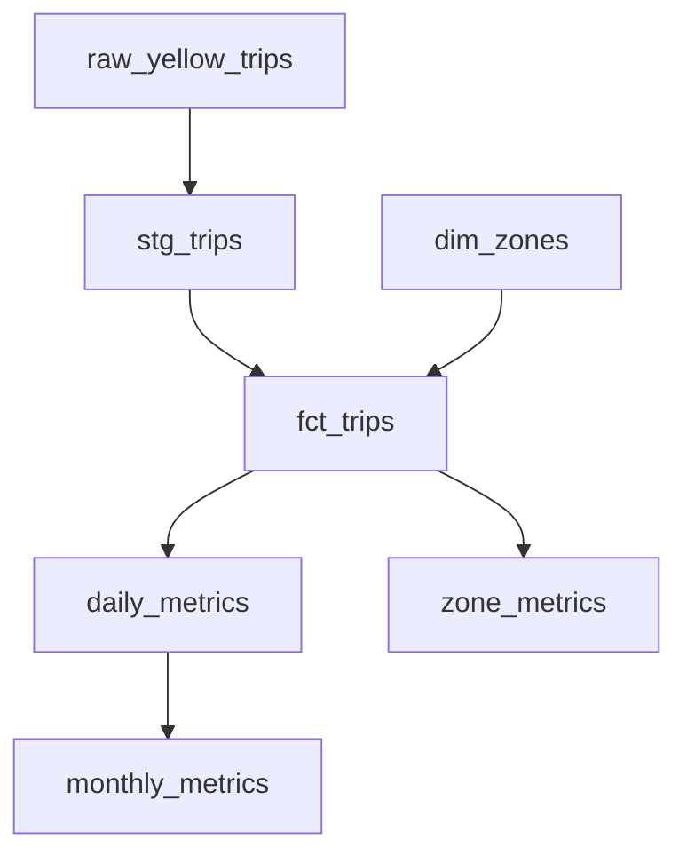

# Local Analytics Stack Benchmark

## Question

What do dbt and SQLMesh provide beyond DuckDB, and what are the engineering and
computational tradeoffs?

## Status

Phase 1: repository scaffold and dependency validation. Pipelines and benchmarks
are not implemented yet. No performance conclusions have been drawn.
See [the implementation plan](docs/implementation-plan.md).

## Architecture

DuckDB is the analytical database/query engine. dbt and SQLMesh are transformation
frameworks. The comparison is DuckDB alone vs dbt + DuckDB vs SQLMesh + DuckDB,
with the same data, business definitions and execution engine.



## Dataset

Planned default: January-June 2025 official NYC TLC Yellow Taxi Parquet files,
plus the taxi zone lookup. July supports the new-month experiment. Raw downloads
stay outside Git under `data/raw/`. CI will use a tiny synthetic fixture.

## Setup

Install uv, then run these commands (also supported on Windows without Make):

```sh
uv sync --frozen
uv run --frozen pytest
uv run --frozen ruff check .
uv run --frozen ruff format --check .
```

`make setup` and `make check` provide equivalent commands. Python is pinned in
`.python-version`; important dependencies are pinned in `pyproject.toml`. These
are baseline versions, not a claim to use the newest releases.

## Experiment methodology

Planned scenarios: initial build, unchanged rerun, new month, historical
correction, revenue logic change, and development isolation. Verify equivalent
outputs before comparing time. Record framework state separately where possible
when interpreting storage. Fixture timings cannot establish TLC-scale performance.

## Benchmark results

No runs yet. Charts and tables will use only recorded executions.

## License

Code is MIT licensed. Dataset terms are separate.
