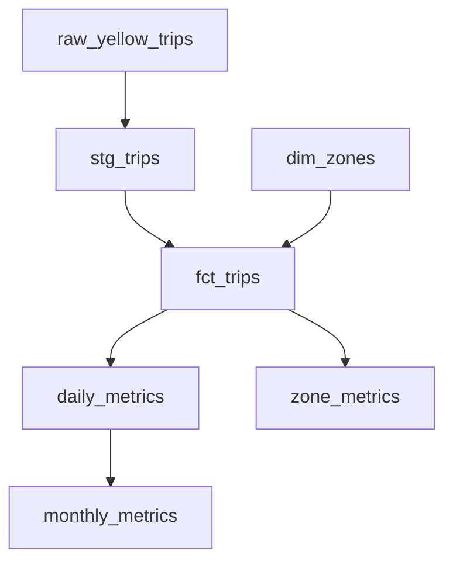

# Local Analytics Stack Benchmark

## Question

What do dbt and SQLMesh provide beyond DuckDB, and what are the engineering and
computational tradeoffs?

## Status

Phases 1-7 complete: all three pipelines, a reusable equivalence verifier and an
initial-build benchmark harness. Remaining scenarios and performance analysis follow.
No comparative performance conclusions have been drawn.
See [the implementation plan](docs/implementation-plan.md).

## Architecture

DuckDB is the analytical database/query engine. dbt and SQLMesh are transformation
frameworks. The comparison is DuckDB alone vs dbt + DuckDB vs SQLMesh + DuckDB,
with the same data, business definitions and execution engine.



## Dataset

Default: January-June 2025 official NYC TLC Yellow Taxi Parquet files, plus the
taxi zone lookup. July supports the new-month experiment. Downloads use the links
published on the [official TLC data page](https://www.nyc.gov/site/tlc/about/tlc-trip-record-data.page).
Raw downloads stay outside Git under `data/raw/`.

```sh
make download MONTHS=6
make download MONTHS=12
uv run --frozen python -m scripts.download --year 2025 --months 6
uv run --frozen python -m scripts.download --year 2025 --start-month 7 --months 1
uv run --frozen python -m scripts.download --months 6 --dry-run
```

`--output-dir` selects a destination; the default is rooted at this repository.
Existing files are validated and reused. Use `--force` to fetch replacements.
Downloads stream to temporary files and replace the destination only after length
and format checks. Failures preserve existing files; rerun the command to retry.
Each successful selection writes a manifest with source URLs, byte sizes, SHA-256
hashes and verification times. Hashes describe local bytes, not publisher-signed
checksums. Cached files do not detect upstream revisions automatically. Parquet
validation checks metadata and key columns, not every row or data page.

The downloader does not remove other months already present in the destination.
Future runners must select the intended files explicitly rather than glob all data.
Year selections before 2025 may have different schemas; only the 2025-shaped
fixtures are validated at this phase.

CI uses [synthetic fixtures](tests/fixtures/README.md): seven monthly Parquet files,
112 rows in total, and a three-zone synthetic lookup. Regenerate with `make fixtures`
or `uv run --frozen python -m scripts.generate_fixtures`. No live downloads run in CI.

## Setup

Install uv, then run these commands (also supported on Windows without Make):

```sh
uv sync --frozen
uv run --frozen pytest
uv run --frozen ruff check .
uv run --frozen ruff format --check .
```

`make setup` and `make check` provide equivalent commands. Python is pinned in
`.python-version`; important dependencies are pinned in `pyproject.toml`. These
are baseline versions, not a claim to use the newest releases.

## Experiment methodology

Planned scenarios: initial build, unchanged rerun, new month, historical
correction, revenue logic change, and development isolation. Verify equivalent
outputs before comparing time. Record framework state separately where possible
when interpreting storage. Fixture timings cannot establish TLC-scale performance.

## DuckDB implementation

The [DuckDB runner](implementations/duckdb/README.md) executes six explicitly ordered
SQL models, validates outputs and reports JSON execution metrics. Every run is a
full rebuild, with transaction rollback on SQL or quality failure. This keeps the
manual orchestration visible. The [shared business definitions](docs/business-definitions.md)
will also govern the later framework implementations.

```sh
make duckdb RAW_DIR=tests/fixtures
uv run --frozen python implementations/duckdb/runner.py --raw-dir tests/fixtures --metrics data/generated/duckdb-run.json
```

The six-month fixture produces 54 staging rows, 42 fact rows, 12 daily rows,
one zone aggregate and six monthly rows. Seven rows per month fail staging rules;
two more fail zone joins. All three synthetic zones remain in the dimension.

## dbt implementation

The [dbt project](implementations/dbt/README.md) adds sources, dependency refs,
model documentation and 14 data tests. Daily metrics use date-based incremental
updates; the other five models rebuild. Historical corrections and late data before
the daily cutoff require `--full-refresh`. This intentionally limited strategy
does not establish a performance advantage over the SQL baseline.

```sh
make dbt RAW_DIR=tests/fixtures
uv run --frozen python implementations/dbt/runner.py --raw-dir tests/fixtures --full-refresh --docs
```

Fixture integration checks compare all six dbt outputs with DuckDB across initial
build, rerun, new month and a full refresh. dbt documentation is generated locally
under `implementations/dbt/target/`.

## SQLMesh implementation

The [SQLMesh implementation](implementations/sqlmesh/README.md) adds native plans,
state, daily intervals, audits and virtual environments. Fixture tests verify its
six outputs against DuckDB, unchanged interval reuse, explicit restatement after
adding July, and development views. Source changes require `--restate`; this
conservative workflow does not claim minimal incremental computation.

```sh
make sqlmesh RAW_DIR=tests/fixtures
```

## Benchmark results

The [benchmark harness](benchmarks/README.md) runs fresh initial builds, retains
logs and provenance, verifies outputs and writes JSON/CSV results. Try
`uv run --frozen python -m benchmarks.run --fixture` or `make benchmark MONTHS=6`
after downloading data. Fixture runs validate the harness; they do not establish
full-scale performance. Execution counts unavailable from a runner remain null.

After building matching selections, `make verify` checks all six output schemas,
row counts and complete row multisets, and writes `data/generated/equivalence.json`.
CI runs this against all three stacks on small fixtures and fails on disagreement.
See the [verification policy](docs/equivalence.md) for exact floating-point comparison
and checksum details.

No controlled benchmark runs yet. Charts and tables will use only recorded executions.

## License

Code is MIT licensed. Dataset terms are separate.
