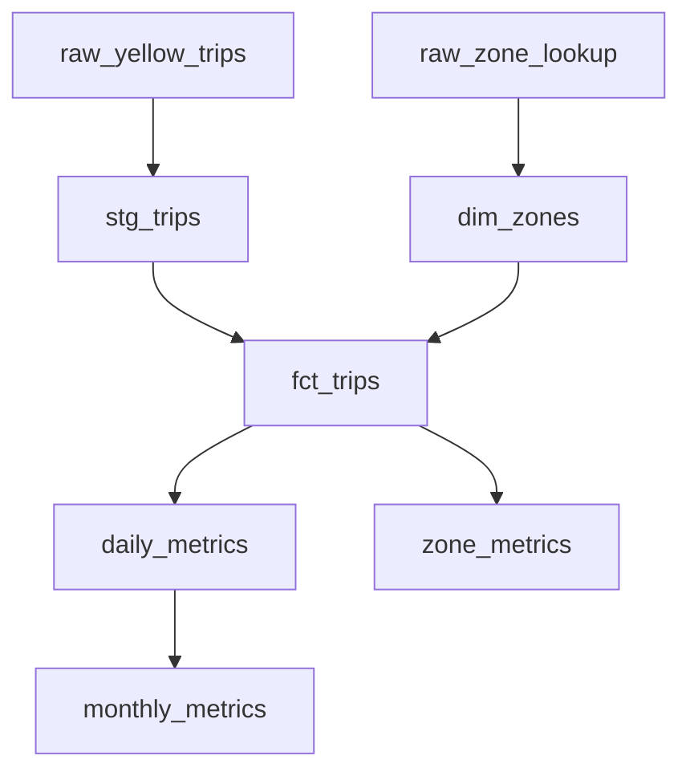
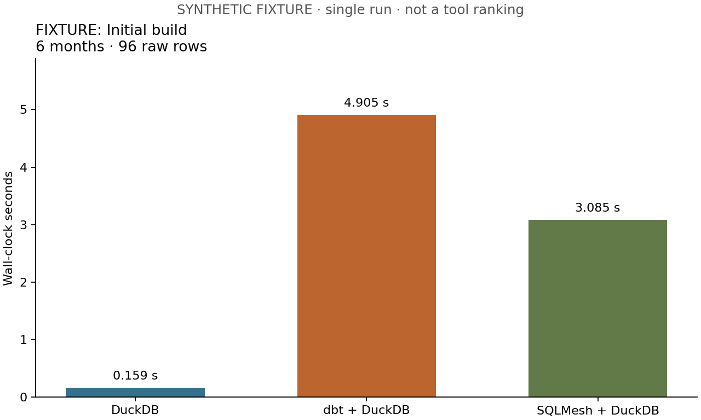
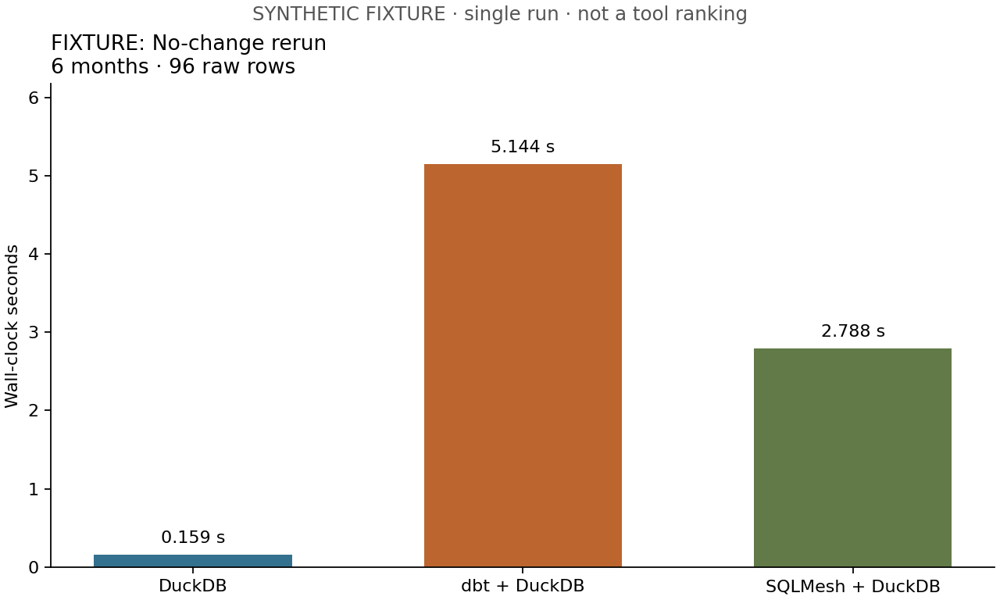
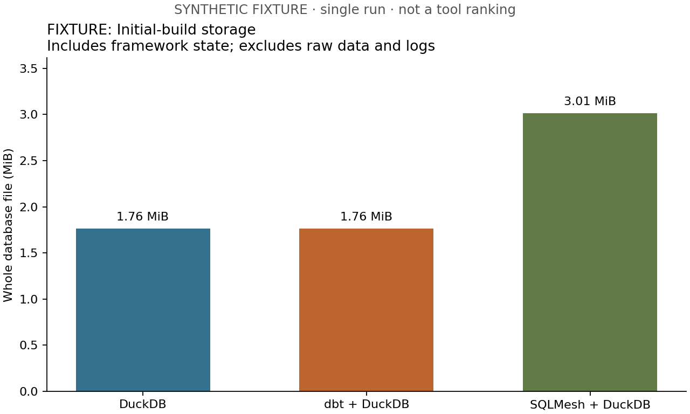

# Local Analytics Stack Benchmark

## Question

What do dbt and SQLMesh provide beyond DuckDB, and what are the engineering and
computational tradeoffs?

This project holds the execution engine and business definitions constant while
changing how transformations are organized, validated and rebuilt. All three
implementations produce equivalent outputs on the fixture experiments. DuckDB
executes the analytical SQL; dbt makes dependencies, tests and documentation part
of the project; SQLMesh additionally uses snapshots, intervals and environments
to plan work. None is an unconditional winner.

**Evidence boundary:** the published results are actual executions on 96-112
synthetic rows, not the full NYC TLC dataset. All ten implementation phases are
complete, but full-scale performance experiments remain outstanding. The fixture
results establish correctness and workflow behavior; they cannot establish which
stack is fastest for millions of trips.

## Architecture

The comparison is **DuckDB alone vs dbt + DuckDB vs SQLMesh + DuckDB**.
DuckDB is the analytical database/query engine. dbt and SQLMesh are transformation
frameworks, not alternative database engines in this experiment.

| Layer | DuckDB alone | dbt + DuckDB | SQLMesh + DuckDB |
| --- | --- | --- | --- |
| Execution | DuckDB 1.3.2 | DuckDB 1.3.2 | DuckDB 1.3.2 |
| Dependencies | Ordered list in Python | `source()` and `ref()` | Parsed model dependencies |
| Quality | Validation SQL and Python tests | Generic/singular dbt tests | Audits and native model tests |
| Change handling here | Explicit rebuild | Explicit refresh policy | Model-change plans and explicit source restatements |
| Development here | Separate database copy | Separate schema | Environment views over physical snapshots |

Framework code lives under [implementations/](implementations/). The wrappers
select files and invoke the appropriate engine/framework. The DuckDB wrapper is
intentionally a small manual runner, not another orchestration framework.

## Dataset

The intended full benchmark uses January-June **2025 NYC TLC Yellow Taxi** Parquet
files and the official taxi zone lookup. July supplies the new-data scenario.
Download links come from the [official TLC data page](https://www.nyc.gov/site/tlc/about/tlc-trip-record-data.page).
Raw files stay under `data/raw/` and are excluded from Git. The downloader selects
months explicitly, validates downloads before replacement, and records local
SHA-256 hashes. Cached downloads do not automatically detect upstream revisions.

The measured fixture has 16 invented trips per month and three synthetic zones:
96 raw rows for January-June and 112 after July. It includes null timestamps,
invalid zones, negative and excessive values, zero fares/distances and month
boundaries. It is neither a real passenger sample nor a distributionally realistic
performance dataset. See [fixture cases](tests/fixtures/README.md).

Before the deliberate corrections, six months yield 54 staging rows, 42 fact rows,
12 daily aggregates, one zone aggregate and six monthly aggregates. The dimension
retains all three zones. Staging rejects seven rows per month; zone joins exclude
two more. These counts are independently asserted in tests.

## Common transformation DAG



The [business contract](docs/business-definitions.md) is shared across all stacks.
Staging casts timestamps, renames columns, normalizes payment codes, derives pickup
date/hour and duration, and applies explicit quality bounds. Facts require valid
pickup/dropoff zone references. Duplicate trips remain because no reliable trip
identifier is supplied. Zero denominators yield NULL ratios.

Revenue A is fare amount. Revenue B is fare + tip + tolls; neither is net profit.
Monthly averages are trip-weighted using supporting daily sums, not averages of
daily averages. Month-over-month growth is a fraction and is NULL for the first
month, calendar gaps or a zero prior denominator. These choices matter more to
semantic equivalence than the framework's SQL syntax.

## Experiment methodology

The [harness](benchmarks/README.md) runs all six scenarios sequentially in one
isolated run directory. Source corrections and SQL edits affect copies only.
Later scenarios inherit previous data, code and state changes.

| Scenario | Change | Policy used in this project |
| --- | --- | --- |
| Initial build | January-June, absent output/state databases | Fresh project copies and full builds |
| No-change rerun | Same inputs and execution horizon | DuckDB rebuild; dbt daily watermark; SQLMesh plan |
| New data | Include July | DuckDB rebuild; dbt full refresh; SQLMesh restatement |
| Historical backfill | Add $1 to finite March fares in the copied file | Full rebuild/refresh or explicit restatement |
| Business logic change | Revenue A becomes B | Manual rebuild, dbt full refresh, SQLMesh model-change plan |
| Development environment | Add $1 to daily average_fare | Database copy, dbt dev schema, SQLMesh dev environment |

The March correction is a controlled synthetic edit, not an official revised file.
All other raw fields remain unchanged. For shorter initial selections, the suite
corrects the last available month up to the third. The development edit leaves
monthly averages unchanged because monthly metrics use supporting sums.

Each scenario must pass [exact output verification](docs/equivalence.md): ordered
column names and SQL types, counts, and every row of all six models, including
duplicate multiplicities. Checksums provide reproducibility evidence, not the
sole equality test. Development also verifies unchanged production checksums.
Unknown scanned-row and SQLMesh executed-model counts remain null.

Elapsed time covers runner subprocess startup through exit, including framework
initialization, plans and native checks. Input hashing, project copying and final
equivalence verification sit outside timing. DuckDB's development database copy
is timed as part of manual isolation. The checks differ across wrappers, so these
are workflow timings rather than isolated SQL timings.

The published run used Windows on AMD64, 24 logical CPUs and Python 3.11.13.
Versions and machine metadata are [recorded here](analysis/case-study/run-metadata.json).
Execution order was fixed: DuckDB, dbt, SQLMesh. Inputs were pre-read, OS caches
were not cleared, and there was one observation per scenario/implementation.
Framework task counts do not prove identical engine thread usage. These limitations
preclude statistical or full-scale performance claims.

## DuckDB implementation

The [plain SQL implementation](implementations/duckdb/README.md) materializes six
tables in a manually maintained order. Validation and transformations share a
transaction: a failed SQL statement or quality check rolls back the rebuild.
The runner records per-model SQL time, output counts and file size.

This is a small surface area to understand and debug. The cost is ownership of
everything around execution: dependency order, refresh policy, isolation, reporting
and future change handling. Every scenario rebuilds every model. A separate database
provides straightforward development isolation, at the cost of copying/rebuilding
data. The fixture's short runtime demonstrates a lightweight path for tiny work,
not a scale advantage over the frameworks.

## dbt implementation

The [dbt project](implementations/dbt/README.md) separates staging, intermediate and
mart models. Sources identify external files; refs express the DAG. Fourteen data
tests cover keys, references and the shared quality/count checks. Generated docs,
compiled SQL, the manifest and run results make project behavior inspectable.

Daily metrics use `is_incremental()` and `delete+insert` keyed by date, recomputing
the latest existing date and newer dates. The other five models rebuild. This
avoids duplicate daily keys on an unchanged rerun but cannot catch arbitrary older
pickup dates in newly delivered files. Accordingly the suite chooses full refresh
for source changes and historical logic changes. This is a limitation of this
implementation, not evidence that dbt cannot support stronger strategies.

The project structure and dbt package/adapter conventions provide a practical
analytics-engineering workflow. That value is separate from whether a particular
incremental SQL predicate saves work. This experiment does not evaluate dbt state
selection/defer or hosted orchestration, so it does not generalize its rebuild
policy to all dbt products. Failed tests do not roll back an entire already-built
DAG in the same way as the manual DuckDB transaction.

## SQLMesh implementation

The [SQLMesh project](implementations/sqlmesh/README.md) uses FULL models plus a
daily INCREMENTAL_BY_TIME_RANGE model. It stores model snapshots and processed
intervals, and creates environment views over versioned physical tables. Audits
validate evaluated data; a native model test checks the zone projection.

On an unchanged rerun at the same horizon, the [recorded plan](analysis/case-study/plan-no-change.json)
has no changes and no scheduled intervals. For the revenue edit, the
[plan](analysis/case-study/plan-revenue-change.json) schedules facts, daily metrics,
zone metrics and monthly metrics. For the development edit, the
[plan](analysis/case-study/plan-development.json) schedules daily and monthly metrics,
reusing the other model snapshots. These are observed planning decisions; interval
entries are not counts of SQL statements, scanned rows or independently timed tasks.

Production uses `analytics.*` views and development uses `analytics__dev.*`.
Physical versions live separately. This distinction explains why a development
environment need not copy every table, although changed models can require new
physical data. The [SQLMesh environment documentation](https://sqlmesh.readthedocs.io/en/stable/concepts/environments/)
describes the broader mechanism.

The raw external views in this project are shared and not versioned as models.
File changes need explicit restatements, and new-data/backfill scenarios conservatively
recompute history. A smaller dataset should use a fresh database because restating
a smaller interval range does not remove older intervals elsewhere. Managing state,
retained versions and source/environment boundaries adds operational complexity.

## Benchmark results

**Synthetic fixture, one run; seconds of end-to-end workflow time.** Run
`20260913T131941Z-c7705b34` completed all 18 builds with equivalent outputs. The
following table is derived from the [recorded measurements](analysis/case-study/source-results.json).

| Scenario | DuckDB alone | dbt + DuckDB | SQLMesh + DuckDB |
| --- | ---: | ---: | ---: |
| Initial build | 0.159 | 4.905 | 3.085 |
| No change | 0.159 | 5.144 | 2.788 |
| New data | 0.165 | 5.248 | 2.738 |
| Historical backfill | 0.176 | 5.382 | 2.717 |
| Business logic change | 0.167 | 5.179 | 3.109 |
| Development environment | 0.175 | 5.024 | 3.090 |

The differences here include process and framework overhead on a tiny workload.
They are not a ranking for production analytical workloads. Rebuilding tables can
also grow database files through retained/free pages even when logical rows do not
change; storage is measured as whole-file MiB, including SQLMesh state.







The [complete generated report](analysis/case-study/report.md) includes charts for
new data, backfill, revenue changes and development, plus storage values and all
18 table rows. [Provenance notes](docs/case-study-notes.md) explain the tracked
snapshot. Development storage is not charted as directly comparable: DuckDB's
number is a separate dev file; dbt/SQLMesh include prod and dev in a shared file.

## What DuckDB solves

Execution: reading Parquet and CSV, joins, aggregation, window functions, persistent
tables and transactional SQL. The experiment needs no external database server.
The surrounding scheduling, validation policy and change workflow still need an owner.

## What dbt solves

Analytics engineering and project management: explicit model dependencies,
materialization choices, tests, documentation and consistent artifacts for review.
Those benefits appear here even where all historical data is rebuilt. Incremental
correctness still depends on the project's source assumptions and refresh rules.

## What SQLMesh solves

Analytics engineering plus state-aware planning and execution. Its snapshots,
interval history and environment views let the project distinguish already-computed
work from work affected by a model edit. The observed empty no-change schedule and
selective dev plan are the clearest evidence. State does not automatically reveal
an external file correction that this project has not declared.

## Tradeoffs

| Situation | What this project suggests |
| --- | --- |
| Small local pipeline with infrequent changes and a clear owner | Plain DuckDB SQL may be enough; keep manual dependencies and validation explicit |
| Several contributors need model ownership, reusable conventions and reviewable artifacts | dbt's project structure can justify its setup and runtime overhead |
| Frequent historical model changes or many development environments | SQLMesh's planning and snapshot reuse may justify additional state management |
| Uncertain late-arrival or correction semantics | Establish the data contract before optimizing either framework's incremental policy |

These are engineering judgments from the implemented workflows, not measured
break-even points. The optional Python anomaly model was omitted so the comparison
stays focused. Relational transformations remain SQL; specialized anomaly logic
could justify Python without changing the central experiment.

## Conclusions

DuckDB alone is sufficient when execution plus a small, understandable manual
workflow meets the project's needs. dbt becomes worthwhile when maintaining a
shared transformation project matters more than minimizing a tiny runner's surface
area. SQLMesh's extra state/planning complexity becomes valuable when repeated
change management and environment reuse would otherwise require substantial manual work.

**Did SQLMesh reduce computation here?** It avoided scheduling model intervals on
the unchanged run and limited the changed development plan to two models. That is
evidence of avoided scheduled model work. The harness does not measure engine CPU
or rows scanned, so it cannot quantify total compute saved. Conservative source
restatements also mean these experiments do not establish minimal incremental or
backfill computation. Full-scale TLC runs, repeated/order-varied trials, explicit
engine resource controls and stronger late-data strategies remain necessary before
making performance recommendations.

## Reproduce and inspect

Use the pinned Python runtime and dependencies through uv. Windows users can use
the uv commands directly without Make.

```sh
uv sync --frozen
uv run --frozen pytest
uv run --frozen ruff check .
uv run --frozen ruff format --check .
uv run --frozen python -m benchmarks.run --fixture --suite
uv run --frozen python -m analysis.generate benchmarks/results/RUN_ID/results.json
```

For TLC experiments, download seven months for the default six-month suite:

```sh
make download MONTHS=7
make benchmark-suite MONTHS=6
```

`make download MONTHS=12` supports a larger initial build (`make benchmark MONTHS=12`);
the suite requires a next month in the same year. `make duckdb`, `make dbt`,
`make sqlmesh`, `make verify` and `make analysis RESULTS=...` expose individual steps.
See the [benchmark guide](benchmarks/README.md), [analysis guide](analysis/README.md),
[contribution guide](CONTRIBUTING.md) and [phase record](docs/implementation-plan.md).

`make clean` removes disposable local databases and framework/test caches while
preserving downloads, benchmark runs and published evidence. Preview the exact
paths with `uv run --frozen python -m scripts.clean --dry-run`.

GitHub Actions installs the lockfile, runs the offline fixture pipelines and quality
tests, and fails on output disagreement. Exact floating-point equality is deliberate;
large-data aggregation differences may require a separately justified tolerance.
pandas is pinned to 2.2.3 because the resolved pandas 3 version failed SQLMesh state
migration with this DuckDB version. No large raw datasets or generated databases
are committed. Code is [MIT licensed](LICENSE); TLC dataset terms are separate.
