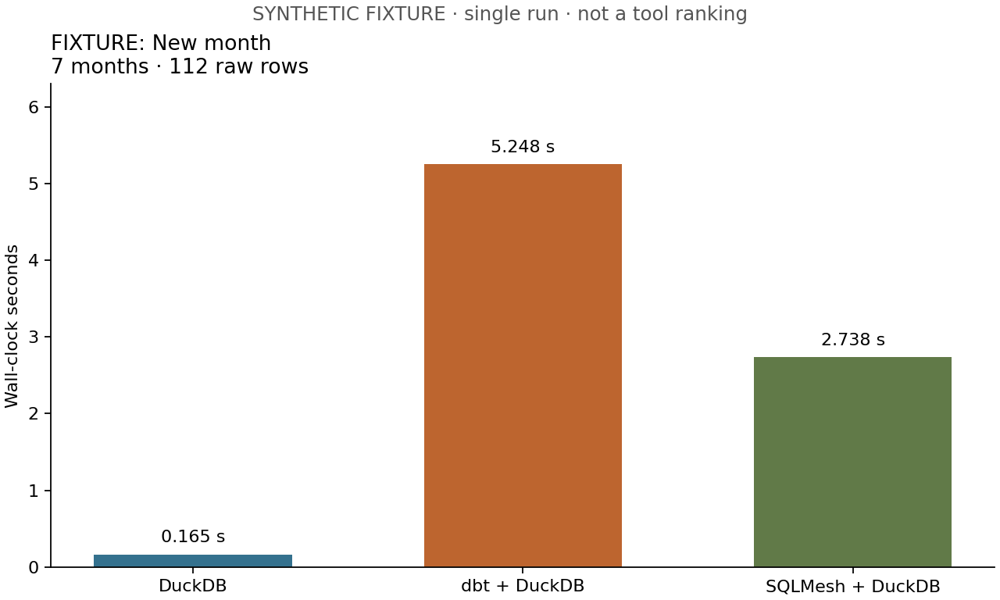
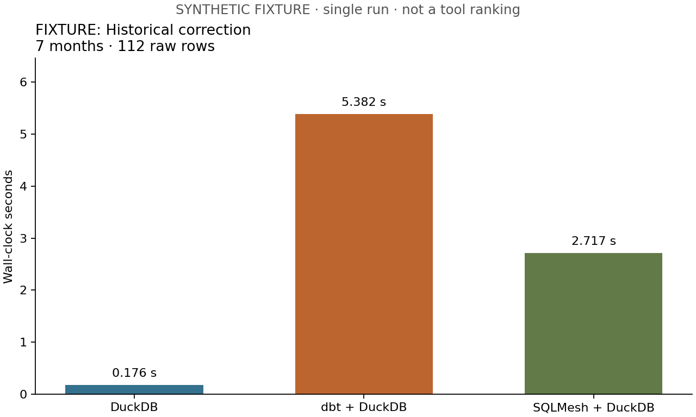
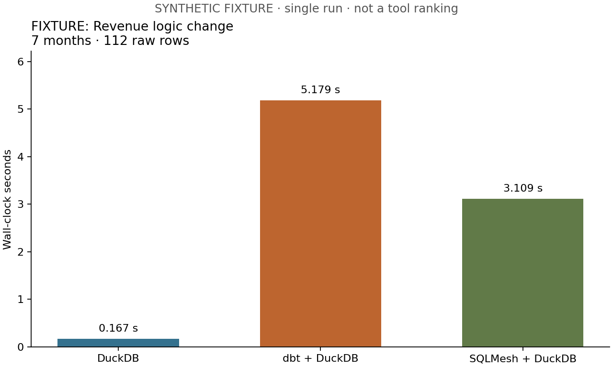
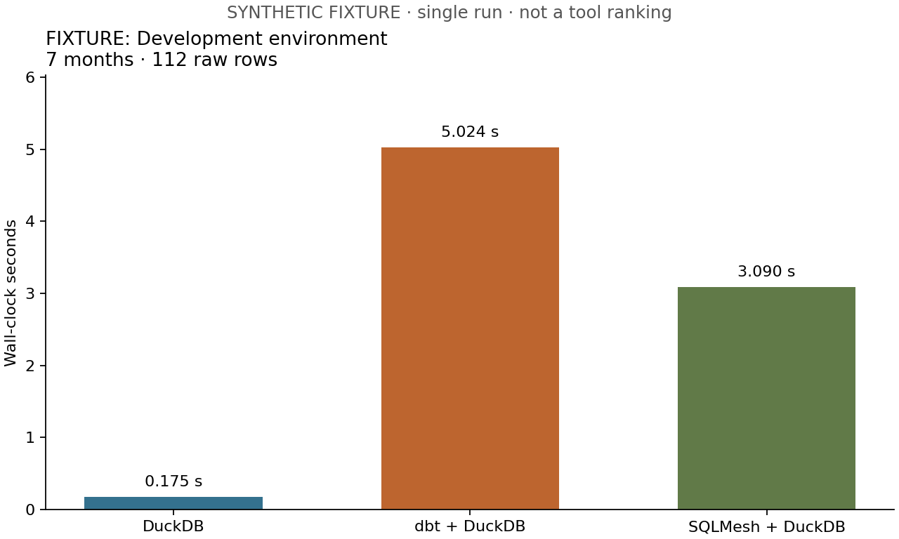

# Recorded benchmark measurements

SYNTHETIC FIXTURE · single run · not a tool ranking

Run: `20260913T131941Z-c7705b34`. Dataset label: `fixture`.

One observation per implementation/scenario. No statistical claims or error bars.
Timings include process startup, framework work and native checks; order is fixed.
The OS cache is not cleared. Later scenarios inherit earlier state and changes.
New data/backfills use conservative full refresh/restatement policies.

| Scenario | Implementation | Months | Raw rows | Seconds | Database MiB |
| --- | --- | ---: | ---: | ---: | ---: |
| Initial build | duckdb | 6 | 96 | 0.159 | 1.762 |
| Initial build | dbt | 6 | 96 | 4.905 | 1.762 |
| Initial build | sqlmesh | 6 | 96 | 3.085 | 3.012 |
| No-change rerun | duckdb | 6 | 96 | 0.159 | 3.512 |
| No-change rerun | dbt | 6 | 96 | 5.144 | 3.512 |
| No-change rerun | sqlmesh | 6 | 96 | 2.788 | 3.262 |
| New month | duckdb | 7 | 112 | 0.165 | 3.762 |
| New month | dbt | 7 | 112 | 5.248 | 3.762 |
| New month | sqlmesh | 7 | 112 | 2.738 | 5.262 |
| Historical correction | duckdb | 7 | 112 | 0.176 | 3.262 |
| Historical correction | dbt | 7 | 112 | 5.382 | 3.512 |
| Historical correction | sqlmesh | 7 | 112 | 2.717 | 7.262 |
| Revenue logic change | duckdb | 7 | 112 | 0.167 | 3.512 |
| Revenue logic change | dbt | 7 | 112 | 5.179 | 3.762 |
| Revenue logic change | sqlmesh | 7 | 112 | 3.109 | 7.262 |
| Development environment | duckdb | 7 | 112 | 0.175 | 3.262 |
| Development environment | dbt | 7 | 112 | 5.024 | 4.012 |
| Development environment | sqlmesh | 7 | 112 | 3.090 | 8.512 |

Database MiB is the whole file, including state and retained/free pages. Development
DuckDB dev has a separate file; dbt/SQLMesh sizes include prod and dev in one file.
Development footprints differ in scope. Only initial storage is charted.
Unknown processed-row and execution-event counts are not plotted or converted to zero.

## Initial build

## No-change rerun

## New month

## Historical correction

## Revenue logic change

## Development environment

## Initial-build storage

